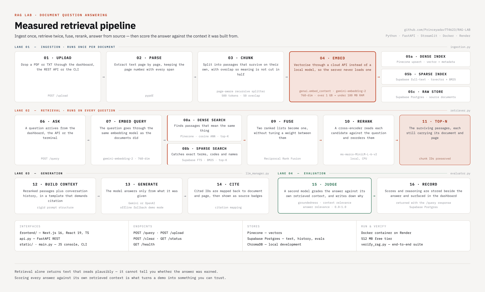

# RAG Lab

Production document question answering — hybrid retrieval, cross-encoder reranking, and an
evaluation loop that scores every answer against the context it was built from.

**[Live demo](https://rag-document-api.onrender.com/)** · free tier, first request wakes the instance



---

## Why this exists

A retrieval system always returns something. Ask it a question and it hands back passages ranked
by similarity, and a language model turns those into fluent prose. Nothing in that pipeline tells
you whether the answer was *earned* — whether it came from your documents or from the model's own
priors.

RAG Lab closes that gap in two places.

**Retrieval is hybrid, not semantic-only.** Dense vector search finds passages that *mean* the
same thing; sparse full-text search catches exact terms, codes and names that embeddings routinely
miss. The two rankings merge through Reciprocal Rank Fusion — which needs no tuned weight between
them — and a cross-encoder then reads each surviving candidate against the question directly.

**Every answer is graded.** A second model scores the response for groundedness, context relevance
and answer relevance on a 0.0–1.0 scale and writes down its reasoning. Those scores return with the
answer, not in a separate offline report.

## Pipeline

| Stage | What happens | Where |
|---|---|---|
| Ingest | Parse PDF/TXT page by page, split into passages that keep their page context | `ingestion.py` |
| Embed | Vectorise through a cloud API so the server never loads an embedding model | `genai.embed_content`, 768-dim |
| Index | Vectors to Pinecone, text to Supabase full-text | `ingestion.py` |
| Retrieve | Dense and sparse search in parallel, fused by RRF | `retriever.py` |
| Rerank | Cross-encoder reorders candidates by true relevance | `ms-marco-MiniLM-L-6-v2` |
| Generate | Answer strictly from retrieved passages, citations enforced by the prompt | `llm_manager.py` |
| Judge | Score the answer against its own retrieved context | `evaluator.py` |

### The constraint that shaped it

The embedding step is why this deploys at all. A local `BAAI/bge-base-en-v1.5` needs over 1 GB of
RAM to load, which kills the process immediately on a 512 MB free tier. Moving embedding to the
Gemini API drops the server's footprint below 100 MB — the vector maths happens on Google's
hardware and the web process only ever holds text and HTTP.

That single decision is the difference between a system that runs on a laptop and one that runs in
production for nothing.

## Quickstart

```bash
git clone https://github.com/Princeyadav774623/RAG-LAB.git
cd RAG-LAB
python -m venv .venv && source .venv/bin/activate
pip install -r requirements.txt
cp .env.example .env          # fill in the five keys below
uvicorn api:app --reload --port 8000
```

`main.py` runs the same pipeline from the terminal. `static/index.html` is a dependency-free
console that talks to a running API.

### Frontend

```bash
cd frontend
npm install
npm run dev
```

Next.js 16 / React 19 / TypeScript — chat console, upload panel, live evaluation gauges.

## Configuration

All five are required.

| Variable | Used for |
|---|---|
| `GEMINI_API_KEY` | Embeddings and generation |
| `OPENAI_API_KEY` | Alternative generation provider |
| `PINECONE_API_KEY` | Dense vector index |
| `SUPABASE_URL` | Text store and full-text search |
| `SUPABASE_KEY` | Text store and full-text search |

Run `init_db.sql` against your Supabase project once to create the tables and the full-text index.

## API

| Method | Route | Purpose |
|---|---|---|
| `POST` | `/query` | Ask a question — returns answer, citations and evaluation scores |
| `POST` | `/upload` | Ingest a document into both indexes |
| `POST` | `/clear` | Empty the indexes |
| `GET` | `/status` | Index state and document count |
| `GET` | `/health` | Liveness check |

## Structure

```
api.py            FastAPI application and routes
ingestion.py      Parsing, chunking, embedding, indexing
retriever.py      Hybrid search, RRF, cross-encoder reranking
llm_manager.py    Provider clients, prompts, citation mapping
evaluator.py      LLM-as-a-judge scoring
main.py           Command-line entry point
verify_rag.py     End-to-end integration test
init_db.sql       Supabase schema and full-text index
frontend/         Next.js 16 + React 19 + TypeScript interface
static/           Dependency-free HTML/JS console
```

## Evaluation

`verify_rag.py` runs the whole path end to end — ingests sample pages, searches, generates a cited
answer and scores it.

```bash
python verify_rag.py
```

On its sample corpus it reports groundedness 0.95, context relevance 0.90, answer relevance 0.95.

## Deployment

`render.yaml` defines a Docker web service on Render's free tier; `start.sh` runs uvicorn with two
workers. The five environment variables must be set in the Render dashboard.

## Limitations

Stated plainly, because they matter:

- **Evaluation is model-graded, not human-labelled.** The scores measure consistency between the
  answer and its retrieved context. That is a useful regression signal, not ground truth.
- **The reported scores come from a sample corpus**, not a held-out benchmark.
- **Free-tier cold starts.** The instance sleeps when idle; the first request after a sleep is slow.
- **`chroma_db` is local-development only.** Production retrieval runs on Pinecone and Supabase.
- Chunking is tuned for prose. Tables and multi-column PDFs are extracted, but not well.

## License

MIT — see [LICENSE](LICENSE).
